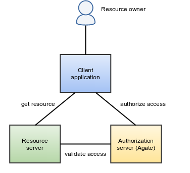

.. _oauth:

OAuth2 Introduction
===================

Agate exposes web services that implements the OAuth2 protocol. OAuth2 is an open authorization protocol which enables applications to access each others data. The authorization refers to the fact that these data are accessed on behalf of a resource owner.

For more details, the OAuth2 specifications are available at `RFC6749 <http://tools.ietf.org/html/rfc6749>`_. See also the `OpenID Connect <http://openid.net/specs/openid-connect-core-1_0.html>`_ specifications built on top of OAuth2.

Roles
-----

The OAuth2 protocol defines several roles:

* the **resource owner** is the person or application that owns the data that is to be shared. In our case a user on Agate could be a resource owner. The resource they own is their data. The resource owner is depicted in the diagram as a person, which is probably the most common situation. The resource owner could also be an application.
* the **resource server** is the server hosting the resources. For instance, Opal or Mica are resource servers.
* the **client application** is the application requesting access to the resources stored on the resource server. These resources are owned by the resource owner. A client application could be an X-ray images analyser that extracts the image data from Opal.
* the **authorization server** is the server authorizing the client application to access the resources of the resource owner: this is the role of Agate. The authorization server and the resource server can be the same server, but it doesn't have to. When Agate is also the resource server, the resource that is accessed is the user profile.

Client ID, Client Secret and Redirect URI
-----------------------------------------

Before a client application can request access to resources on a resource server, the client application must first register with the authorization server associated with the resource server. In Agate this is done by adding the client as a new Application.

The registration is typically a one-time task. Once registered, the registration remains valid, unless the client application registration is revoked by the Agate's administrator.

At registration the client application is assigned a client ID and a client secret (password) by the authorization server. The client ID and secret is unique to the client application on that authorization server. In terms of Agate's domain, the client ID is the application's name and the client secret is the application's key.

During the registration the client needs to provide a redirect URI. This redirect URI is used when a resource owner grants authorization to the client application. When a resource owner has successfully authorized the client application via the authorization server, the resource owner is redirected back to the client application, to the redirect URI.

Scopes
------

The scopes are space-separated the application IDs, optionally qualified by a permission. As an example, if an application registered in Agate with ID **foo** declares the **read** permission (= the permission to access to the resource granted by foo is read-only), then the authorization scope will be **foo:read**. If no action is specified, Agate will assume that foo grants full access to the resource. The permissions are specific to the application and it is the responsibility of the resource server to handle them as announced.

Flows
-----

* :doc:`authorization-code-grant-flow`: when a client application wants access to the resources of a resource owner, hosted on a resource server, the client application must first obtain an `authorization code grant <https://tools.ietf.org/html/rfc6749#section-4.1>`_ from the authorization server (Agate).
* :doc:`resource-owner-password-credentials-grant-flow`: suitable for clients capable of obtaining the resource owner's credentials (username and password),
* :doc:`openid-connect-flow`: when client wants to get the user information from Agate (authorization and resource are the same).
